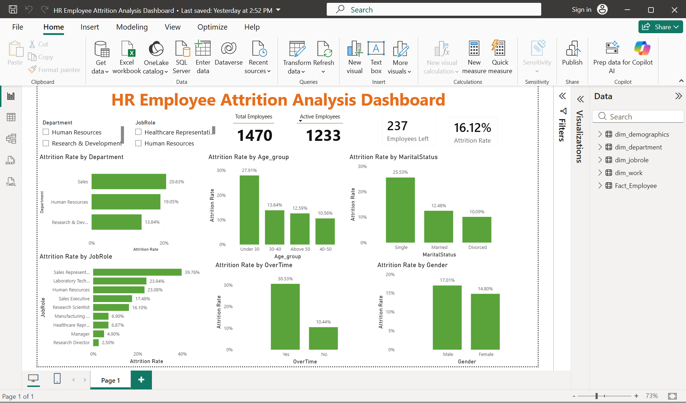

# HR Employee Attrition Analysis
Dataset Source: Kaggle - IBM HR Analytics Employee Attrition Dataset

## Project Overview

This project analyzes employee attrition data to identify the key factors contributing to employee turnover. The analysis was completed using Microsoft Excel, SQL, Google Colab, and Power BI.

The project includes Excel-based analysis, SQL querying, Power BI data modeling, DAX measure creation, dashboard building, and business recommendations.

## Business Problem

Employee attrition can increase recruitment costs, reduce productivity, and create operational challenges. The objective of this project is to identify which employee groups have higher attrition and what factors may be contributing to employee turnover.

## Tools Used

* Microsoft Excel
* SQL
* SQLite
* Google Colab
* Power BI Desktop
* Power Query
* DAX
* GitHub

## Dataset Overview

The dataset contains employee-level HR information.

| Metric                 |  Value |
| ---------------------- | -----: |
| Total Employees        |  1,470 |
| Employees Left         |    237 |
| Active Employees       |  1,233 |
| Overall Attrition Rate | 16.12% |

## Key Columns Used

* Age
* Attrition
* Department
* JobRole
* Gender
* MaritalStatus
* OverTime
* MonthlyIncome
* JobSatisfaction
* WorkLifeBalance
* YearsAtCompany
* TotalWorkingYears
* EmployeeNumber

## Excel Analysis

Excel was used for initial data analysis, validation, and dashboard creation.

### Excel Work Completed

* Cleaned and reviewed the HR dataset
* Created Pivot Tables for attrition analysis
* Built KPI cards for total employees, active employees, employees left, and attrition rate
* Created charts for attrition by department, job role, overtime, age group, marital status, and gender
* Created an Excel dashboard to summarize HR attrition insights

## SQL Analysis

SQL was used to validate Excel results and perform deeper analysis on employee attrition patterns. The SQL analysis was completed using SQLite in Google Colab.

## SQL Queries Used

### 1. Overall Attrition Count

```sql
SELECT
    Attrition,
    COUNT(*) AS Employee_Count
FROM hr
GROUP BY Attrition;
```

### Result

| Attrition | Employee Count |
| --------- | -------------: |
| No        |          1,233 |
| Yes       |            237 |

---

### 2. Attrition Rate by Department

```sql
SELECT
    Department,
    COUNT(*) AS Total_Employees,
    SUM(CASE WHEN Attrition = 'Yes' THEN 1 ELSE 0 END) AS Employees_Left,
    ROUND(
        SUM(CASE WHEN Attrition = 'Yes' THEN 1 ELSE 0 END) * 100.0 / COUNT(*),
        2
    ) AS Attrition_Rate
FROM hr
GROUP BY Department
ORDER BY Attrition_Rate DESC;
```

### Result

| Department             | Total Employees | Employees Left | Attrition Rate |
| ---------------------- | --------------: | -------------: | -------------: |
| Sales                  |             446 |             92 |         20.63% |
| Human Resources        |              63 |             12 |         19.05% |
| Research & Development |             961 |            133 |         13.84% |

---

### 3. Attrition Rate by Job Role

```sql
SELECT
    JobRole,
    COUNT(*) AS Total_Employees,
    SUM(CASE WHEN Attrition = 'Yes' THEN 1 ELSE 0 END) AS Employees_Left,
    ROUND(
        SUM(CASE WHEN Attrition = 'Yes' THEN 1 ELSE 0 END) * 100.0 / COUNT(*),
        2
    ) AS Attrition_Rate
FROM hr
GROUP BY JobRole
ORDER BY Attrition_Rate DESC;
```

### Result

| JobRole                   | Total Employees | Employees Left | Attrition Rate |
| ------------------------- | --------------: | -------------: | -------------: |
| Sales Representative      |              83 |             33 |         39.76% |
| Laboratory Technician     |             259 |             62 |         23.94% |
| Human Resources           |              52 |             12 |         23.08% |
| Sales Executive           |             326 |             57 |         17.48% |
| Research Scientist        |             292 |             47 |         16.10% |
| Manufacturing Director    |             145 |             10 |          6.90% |
| Healthcare Representative |             131 |              9 |          6.87% |
| Manager                   |             102 |              5 |          4.90% |
| Research Director         |              80 |              2 |          2.50% |

---

### 4. Attrition Rate by OverTime

```sql
SELECT
    OverTime,
    COUNT(*) AS Total_Employees,
    SUM(CASE WHEN Attrition = 'Yes' THEN 1 ELSE 0 END) AS Employees_Left,
    ROUND(
        SUM(CASE WHEN Attrition = 'Yes' THEN 1 ELSE 0 END) * 100.0 / COUNT(*),
        2
    ) AS Attrition_Rate
FROM hr
GROUP BY OverTime
ORDER BY Attrition_Rate DESC;
```

### Result

| OverTime | Total Employees | Employees Left | Attrition Rate |
| -------- | --------------: | -------------: | -------------: |
| Yes      |             416 |            127 |         30.53% |
| No       |           1,054 |            110 |         10.44% |

---

### 5. Attrition Rate by Age Group

```sql
SELECT
    CASE
        WHEN Age < 30 THEN 'Under 30'
        WHEN Age BETWEEN 30 AND 40 THEN '30-40'
        WHEN Age BETWEEN 41 AND 50 THEN '41-50'
        ELSE '50+'
    END AS Age_Group,

    COUNT(*) AS Total_Employees,

    SUM(CASE WHEN Attrition = 'Yes' THEN 1 ELSE 0 END) AS Employees_Left,

    ROUND(
        SUM(CASE WHEN Attrition = 'Yes' THEN 1 ELSE 0 END) * 100.0 / COUNT(*),
        2
    ) AS Attrition_Rate

FROM hr

GROUP BY Age_Group

ORDER BY Attrition_Rate DESC;
```

### Result

| Age Group | Total Employees | Employees Left | Attrition Rate |
| --------- | --------------: | -------------: | -------------: |
| Under 30  |             326 |             91 |         27.91% |
| 30-40     |             679 |             94 |         13.84% |
| 50+       |             143 |             18 |         12.59% |
| 41-50     |             322 |             34 |         10.56% |

---

### 6. Attrition Rate by Marital Status

```sql
SELECT
    MaritalStatus,
    COUNT(*) AS Total_Employees,
    SUM(CASE WHEN Attrition = 'Yes' THEN 1 ELSE 0 END) AS Employees_Left,
    ROUND(
        SUM(CASE WHEN Attrition = 'Yes' THEN 1 ELSE 0 END) * 100.0 / COUNT(*),
        2
    ) AS Attrition_Rate
FROM hr
GROUP BY MaritalStatus
ORDER BY Attrition_Rate DESC;
```

### Result

| MaritalStatus | Total Employees | Employees Left | Attrition Rate |
| ------------- | --------------: | -------------: | -------------: |
| Single        |             470 |            120 |         25.53% |
| Married       |             673 |             84 |         12.48% |
| Divorced      |             327 |             33 |         10.09% |

---

### 7. Job Role Attrition Ranking Using CTE and RANK()

```sql
WITH jobrole_attrition AS
(
    SELECT
        JobRole,
        COUNT(*) AS Total_Employees,
        SUM(CASE WHEN Attrition = 'Yes' THEN 1 ELSE 0 END) AS Employees_Left,
        ROUND(
            SUM(CASE WHEN Attrition = 'Yes' THEN 1 ELSE 0 END) * 100.0 / COUNT(*),
            2
        ) AS Attrition_Rate
    FROM hr
    GROUP BY JobRole
)

SELECT
    JobRole,
    Total_Employees,
    Employees_Left,
    Attrition_Rate,
    RANK() OVER(
        ORDER BY Attrition_Rate DESC
    ) AS Attrition_Rank
FROM jobrole_attrition;
```

### Result

| JobRole                   | Total Employees | Employees Left | Attrition Rate | Attrition Rank |
| ------------------------- | --------------: | -------------: | -------------: | -------------: |
| Sales Representative      |              83 |             33 |         39.76% |              1 |
| Laboratory Technician     |             259 |             62 |         23.94% |              2 |
| Human Resources           |              52 |             12 |         23.08% |              3 |
| Sales Executive           |             326 |             57 |         17.48% |              4 |
| Research Scientist        |             292 |             47 |         16.10% |              5 |
| Manufacturing Director    |             145 |             10 |          6.90% |              6 |
| Healthcare Representative |             131 |              9 |          6.87% |              7 |
| Manager                   |             102 |              5 |          4.90% |              8 |
| Research Director         |              80 |              2 |          2.50% |              9 |

---

### 8. Attrition Rate by Gender

```sql
SELECT
    Gender,
    COUNT(*) AS Total_Employees,
    SUM(CASE WHEN Attrition = 'Yes' THEN 1 ELSE 0 END) AS Employees_Left,
    ROUND(
        SUM(CASE WHEN Attrition = 'Yes' THEN 1 ELSE 0 END) * 100.0 / COUNT(*),
        2
    ) AS Attrition_Rate
FROM hr
GROUP BY Gender
ORDER BY Attrition_Rate DESC;
```

### Result

| Gender | Total Employees | Employees Left | Attrition Rate |
| ------ | --------------: | -------------: | -------------: |
| Male   |             882 |            150 |         17.01% |
| Female |             588 |             87 |         14.80% |

---

### 9. Department Attrition Ranking Using CTE and RANK()

```sql
WITH department_attrition AS
(
    SELECT
        Department,
        COUNT(*) AS Total_Employees,
        SUM(CASE WHEN Attrition = 'Yes' THEN 1 ELSE 0 END) AS Employees_Left,
        ROUND(
            SUM(CASE WHEN Attrition = 'Yes' THEN 1 ELSE 0 END) * 100.0 / COUNT(*),
            2
        ) AS Attrition_Rate
    FROM hr
    GROUP BY Department
)

SELECT
    Department,
    Total_Employees,
    Employees_Left,
    Attrition_Rate,
    RANK() OVER(
        ORDER BY Attrition_Rate DESC
    ) AS Department_Rank
FROM department_attrition;
```

### Result

| Department             | Total Employees | Employees Left | Attrition Rate | Department Rank |
| ---------------------- | --------------: | -------------: | -------------: | --------------: |
| Sales                  |             446 |             92 |         20.63% |               1 |
| Human Resources        |              63 |             12 |         19.05% |               2 |
| Research & Development |             961 |            133 |         13.84% |               3 |

---

### 10. Top 10 Highest Paid Employees Using RANK()

```sql
SELECT
    EmployeeNumber,
    JobRole,
    Department,
    MonthlyIncome,
    RANK() OVER(
        ORDER BY MonthlyIncome DESC
    ) AS Income_Rank
FROM hr
ORDER BY Income_Rank
LIMIT 10;
```

### Result

| EmployeeNumber | JobRole           | Department             | MonthlyIncome | Income Rank |
| -------------: | ----------------- | ---------------------- | ------------: | ----------: |
|            259 | Manager           | Research & Development |        19,999 |           1 |
|           1035 | Research Director | Research & Development |        19,973 |           2 |
|           1191 | Manager           | Research & Development |        19,943 |           3 |
|            226 | Manager           | Research & Development |        19,926 |           4 |
|            787 | Manager           | Research & Development |        19,859 |           5 |
|           1282 | Manager           | Sales                  |        19,847 |           6 |
|           1038 | Manager           | Sales                  |        19,845 |           7 |
|           1740 | Manager           | Sales                  |        19,833 |           8 |
|           1255 | Research Director | Research & Development |        19,740 |           9 |
|           1338 | Manager           | Human Resources        |        19,717 |          10 |

---

### 11. Average Monthly Income by Job Role

```sql
SELECT
    JobRole,
    COUNT(*) AS Total_Employees,
    ROUND(AVG(MonthlyIncome),2) AS Avg_Monthly_Income
FROM hr
GROUP BY JobRole
ORDER BY Avg_Monthly_Income DESC;
```

### Result

| JobRole                   | Total Employees | Average Monthly Income |
| ------------------------- | --------------: | ---------------------: |
| Manager                   |             102 |              17,181.68 |
| Research Director         |              80 |              16,033.55 |
| Healthcare Representative |             131 |               7,528.76 |
| Manufacturing Director    |             145 |               7,295.14 |
| Sales Executive           |             326 |               6,924.28 |
| Human Resources           |              52 |               4,235.75 |
| Research Scientist        |             292 |               3,239.97 |
| Laboratory Technician     |             259 |               3,237.17 |
| Sales Representative      |              83 |               2,626.00 |

---

### 12. Salary Ranking by Job Role Using CTE and RANK()

```sql
WITH jobrole_salary AS
(
    SELECT
        JobRole,
        COUNT(*) AS Total_Employees,
        ROUND(AVG(MonthlyIncome),2) AS Avg_Monthly_Income
    FROM hr
    GROUP BY JobRole
)

SELECT
    JobRole,
    Total_Employees,
    Avg_Monthly_Income,
    RANK() OVER(
        ORDER BY Avg_Monthly_Income DESC
    ) AS Salary_Rank
FROM jobrole_salary;
```

### Result

| JobRole                   | Total Employees | Average Monthly Income | Salary Rank |
| ------------------------- | --------------: | ---------------------: | ----------: |
| Manager                   |             102 |              17,181.68 |           1 |
| Research Director         |              80 |              16,033.55 |           2 |
| Healthcare Representative |             131 |               7,528.76 |           3 |
| Manufacturing Director    |             145 |               7,295.14 |           4 |
| Sales Executive           |             326 |               6,924.28 |           5 |
| Human Resources           |              52 |               4,235.75 |           6 |
| Research Scientist        |             292 |               3,239.97 |           7 |
| Laboratory Technician     |             259 |               3,237.17 |           8 |
| Sales Representative      |              83 |               2,626.00 |           9 |

---

### 13. Combined Salary and Attrition Analysis Using CTE and RANK()

```sql
WITH jobrole_summary AS
(
    SELECT
        JobRole,
        COUNT(*) AS Total_Employees,
        SUM(CASE WHEN Attrition = 'Yes' THEN 1 ELSE 0 END) AS Employees_Left,
        ROUND(
            SUM(CASE WHEN Attrition = 'Yes' THEN 1 ELSE 0 END) * 100.0 / COUNT(*),
            2
        ) AS Attrition_Rate,
        ROUND(AVG(MonthlyIncome),2) AS Avg_Monthly_Income
    FROM hr
    GROUP BY JobRole
)

SELECT
    JobRole,
    Total_Employees,
    Employees_Left,
    Attrition_Rate,
    Avg_Monthly_Income,
    RANK() OVER(
        ORDER BY Attrition_Rate DESC
    ) AS Attrition_Rank,
    RANK() OVER(
        ORDER BY Avg_Monthly_Income DESC
    ) AS Salary_Rank
FROM jobrole_summary
ORDER BY Attrition_Rank;
```

### Result

| JobRole                   | Total Employees | Employees Left | Attrition Rate | Average Monthly Income | Attrition Rank | Salary Rank |
| ------------------------- | --------------: | -------------: | -------------: | ---------------------: | -------------: | ----------: |
| Sales Representative      |              83 |             33 |         39.76% |               2,626.00 |              1 |           9 |
| Laboratory Technician     |             259 |             62 |         23.94% |               3,237.17 |              2 |           8 |
| Human Resources           |              52 |             12 |         23.08% |               4,235.75 |              3 |           6 |
| Sales Executive           |             326 |             57 |         17.48% |               6,924.28 |              4 |           5 |
| Research Scientist        |             292 |             47 |         16.10% |               3,239.97 |              5 |           7 |
| Manufacturing Director    |             145 |             10 |          6.90% |               7,295.14 |              6 |           4 |
| Healthcare Representative |             131 |              9 |          6.87% |               7,528.76 |              7 |           3 |
| Manager                   |             102 |              5 |          4.90% |              17,181.68 |              8 |           1 |
| Research Director         |              80 |              2 |          2.50% |              16,033.55 |              9 |           2 |

## Power BI Dashboard

An interactive HR Employee Attrition Dashboard was created in Power BI.

### Power BI Work Completed

* Imported raw HR employee data into Power BI
* Cleaned and transformed data using Power Query
* Removed unnecessary constant columns such as Over18 and StandardHours
* Created a star schema data model
* Built one-to-many relationships between fact and dimension tables
* Created DAX measures for KPI cards and analysis
* Added slicers for Department and Job Role
* Created visual analysis for attrition by department, job role, overtime, age group, marital status, and gender

## Power BI Data Model

The original flat dataset was transformed into a star schema model.

### Fact Table

* Fact_Employee

### Dimension Tables

* Dim_Department
* Dim_JobRole
* Dim_Demographics
* Dim_Work

The dimension tables filter the fact table using one-to-many, single-direction relationships.

## DAX Measures Created

### Total Employees

```DAX
Total Employees = COUNTROWS(Fact_Employee)
```

### Employees Left

```DAX
Employees Left =
CALCULATE(
    COUNTROWS(Fact_Employee),
    Fact_Employee[Attrition] = "Yes"
)
```

### Active Employees

```DAX
Active Employees =
CALCULATE(
    COUNTROWS(Fact_Employee),
    Fact_Employee[Attrition] = "No"
)
```

### Attrition Rate

```DAX
Attrition Rate =
DIVIDE(
    [Employees Left],
    [Total Employees],
    0
)
```

### Average Monthly Income

```DAX
Average Monthly Income =
AVERAGE(Fact_Employee[MonthlyIncome])
```

### Average Age

```DAX
Average Age =
AVERAGE(Fact_Employee[Age])
```

## Dashboard Preview



## Key Insights

### 1. Overall Attrition

The company has an overall attrition rate of 16.12%.

### 2. Department-Level Insight

Sales has the highest attrition rate at 20.63%, followed by Human Resources at 19.05%. Research & Development has the highest number of employees but a lower attrition rate of 13.84%.

### 3. Job Role-Level Insight

Sales Representative is the highest-risk job role, with an attrition rate of 39.76%. Laboratory Technician and Human Resources also show high attrition rates.

### 4. Overtime Insight

Employees working overtime have an attrition rate of 30.53%, compared to 10.44% for employees not working overtime. This shows that overtime is strongly associated with higher attrition.

### 5. Age Group Insight

Employees under 30 have the highest attrition rate at 27.91%. This suggests that younger employees may require better engagement, growth opportunities, or career support.

### 6. Marital Status Insight

Single employees have the highest attrition rate at 25.53%, compared with married and divorced employees.

### 7. Gender Insight

Male employees have a slightly higher attrition rate at 17.01%, compared with female employees at 14.80%. The difference is not very large.

### 8. Salary and Attrition Insight

Sales Representative had the highest attrition rate and also the lowest average monthly income among job roles. This suggests that compensation may be one possible factor behind higher attrition in this role.

## Business Recommendations

* Review overtime workload because employees working overtime have significantly higher attrition.
* Focus retention efforts on Sales Representatives because this role has the highest attrition rate.
* Review compensation and growth opportunities for low-income, high-attrition job roles.
* Create early-career retention programs for employees under 30.
* Monitor Sales department attrition closely because it has the highest department-level attrition rate.
* Use HR dashboards regularly to track attrition trends and identify high-risk employee groups.

## Project Files

| File                                                     | Description                          |
| -------------------------------------------------------- | ------------------------------------ |
| HR_Attrition_Analysis_Final.xlsx                         | Excel analysis and dashboard         |
| HR_Attrition_SQL_Analysis.ipynb                          | SQL analysis in Google Colab         |
| HR Employee Attrition Analysis Dashboard.pbix            | Power BI dashboard file              |
| powerbi_dashboard.png                                    | Power BI dashboard screenshot        |
| HR_Employee_Attrition_PowerBI_Final_Report_Corrected.pdf | Final Power BI project report        |
| HR_Employee_Attrition_Analysis_Report.pdf                | Earlier Excel and SQL project report |

## Final Conclusion

The analysis shows that attrition is mainly higher among Sales Representatives, overtime employees, employees under 30, and single employees. Overtime and job role appear to be strong factors related to employee attrition.

This project demonstrates data cleaning, Excel analysis, SQL querying, Power BI data modeling, DAX measure creation, dashboard building, and business insight generation.

## Project Status

Completed.

## Author

**Shubham Kumar Dubey**

Aspiring Data Analyst skilled in Excel, SQL, Power BI, Power Query, DAX, and dashboard reporting.

GitHub: `shubham-dubee`
